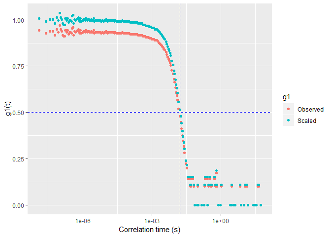
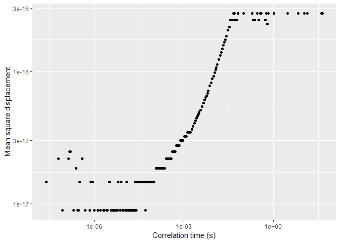

<!-- README.md is generated from README.Rmd. Please edit that file -->
*diwanalr*
==========

### An introduction to the diwanalr package

The *diwanalr* (**di**ffusing-**w**ave spectroscopy (DWS) **anal**ysis using **R**) package contains a number of functions suitable for analysing DWS data.

DWS is derived from dynamic light scattering which is an optical technique that studies the dynamics of scattered light. If carefully calibrated, DWS allows the quantitative measurement of microscopic motion in a soft material from which micro-rheology can be used to determine the rheological properties of a complex medium.

Research capability exists which allows the application of DWS to food systems. In some instances, the analysis of data resulting from such capability can be tedious (e.g. using spreadsheets). This package is intended to allow users of such capability to perform analysis of DWS data in a more straightforward manner.

If needed, the *diwanalr* package can be downloaded using:

    install.packages("devtools") 
    devtools::install_github("peterjwatkins/diwanalr", force=TRUE)

One proposed workflow involves the calculation of the storage and loss moduli. The workflow consists of three steps:

*The temporal autocorrelation function*, *g*<sub>1</sub>(*t*). In some cases, the output generated from research equipment consists of a CSV file, with two columns; the first being the correlation time while the second is the measured value of the *intensity autocorrelation function*, noted as *g*<sub>2</sub>(*t*). The *g*<sub>2</sub>(*t*) values are related to *g*<sub>1</sub>(*t*) by the Seigert relationship where *g*<sub>2</sub>(*t*) = 1 + |*g*<sub>1</sub>(*t*)|**<sup>2</sup>. The function, *form\_g1*, accepts a tibble consisting measured correlation times, *t*, and associated *g*<sub>2</sub>(*t*) values, and returns a tibble consisting of three columns; namely, the correlation time (*t*), related *g*<sub>1</sub>(*t*) values as well a set of scaled *g*<sub>1</sub>(*t*) values, ranging from 0 to approximately 1. The scaled values are deployed in the second step of the workflow. Some functionality is provided to allow the user to set an appropriate normalisation value. The function *plot\_g1* is available to visualise the data. The *plot\_g1* function uses a spline to estimate *t*<sub>1/2</sub> for the scaled data.

``` r
library(diwanalr)
data(dws)
g1 <- form_g1(dws)
head(g1)
#>       time  Observed    Scaled
#> 1 1.25e-08 0.9433981 1.0078740
#> 2 2.50e-08 0.9273618 0.9907417
#> 3 3.75e-08 0.9380832 1.0021958
#> 4 5.00e-08 0.9380832 1.0021958
#> 5 6.25e-08 0.9165151 0.9791537
#> 6 7.50e-08 0.9486833 1.0135204
plot_g1(g1)
```



*The mean square displacement*. The next stage involves calculating the mean square displacement (MSD), based on the scaled *g*<sub>1</sub>(*t*) values using a minimisation step (see the vignette for further detail). The function, *form\_msd* is used for this purpose, accepting the output from *form\_g1* and returning a tibble with the time and related MSD. The function *plot\_msd* is available to visualise the output data.

``` r
msd <- form_msd(g1)
head(msd)
#>        time          msd
#> 2  2.50e-08 1.456789e-17
#> 5  6.25e-08 2.192847e-17
#> 7  8.75e-08 8.959619e-18
#> 11 1.38e-07 2.192847e-17
#> 12 1.50e-07 2.488946e-17
#> 13 1.63e-07 2.488946e-17
plot_msd(msd)
```



*The viscoelastic, storage and loss moduli*. The last stage is to determine the viscoelastic modulus (*G*) from the mean square displacement, which is then used to determine the related storage and loss moduli. The function *form\_modulus* is used for this purpose, accepting the output from *form\_msd* and returning a tibble with the time and related storage (*G'*) and loss (*G''*) moduli. The function *plot\_modulus* is available for visualising the data resulting from the *form\_modulus* function.

``` r
mods <- form_modulus(msd)
head(mods)
#> # A tibble: 6 x 3
#>        freq `Storage (G')` `Loss (G'')`
#>       <dbl>          <dbl>        <dbl>
#> 1 16000000            94.2       -32.6 
#> 2 11428571.          299.         53.4 
#> 3  7246377.          -62.7         8.05
#> 4  6666667.           41.2       105.  
#> 5  6134969.          -80.4       -22.8 
#> 6  5000000            68.7      -101.
plot_modulus(mods)
```


